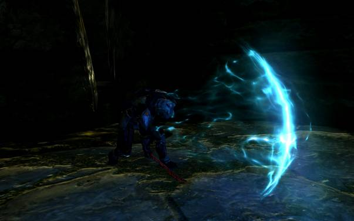
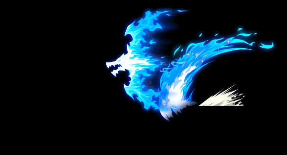
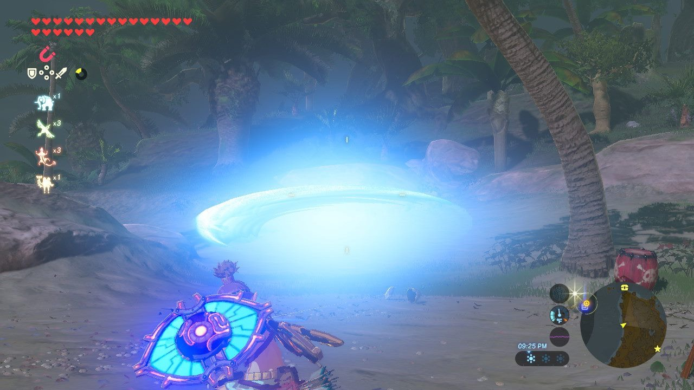

# COMP210_2_AR VR Task

## Sword swing slash beam

For this project I will be trying to make a mechanic where player has a sword and by swinging it a beam will come out 
in the direction of the swing. This will, potentially, be calculated by the velocity of a swing. The faster it is 
the further the beam will travel. As an idea to add into this mechanic is charging mechanic. Standing in a stance 
(or raising the sharp side of the sword upwards) will charge the sword and, therefore, a beam will be larger and travel 
even further. 

## Key features

* Only one controller is a sword
* Swing a sword to make a wave come out in that direction

## Potential game

The mechanic could be integrated into a game where player has to slash incoming objects or enemies. 
The further the slashed enemy/object is the more score player will get. 

## Challenges

* Calculating velocity of the swing
* Making a beam travel right distance

## Interesting ideas to add

* Charge the sword by standing in a "stance"
* Charged sword makes a bigger wave.

## Non-VR games that have it

* Destiny 2
* Hollow knight
* Zelda: Breath of the Wild

## VR sword-based games market

Most VR games that include swords are based on medieval times. Although some are based of fictional, having lightsabers 
instead of swords. But I haven't seen any sword beam-based VR games. But there is this game called Valkyrie Blade VR, 
where you fight Skyrim-like enemies and if the player hits an enemy a line of swing trace appears. This is shown 
in the game's second trailer (https://www.youtube.com/watch?v=DFM23RavBOM)

## Picture examples

